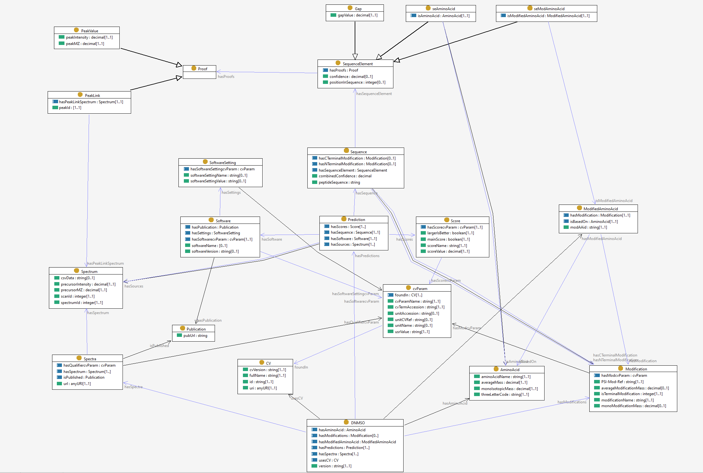

# DNMSO; an Ontology for Representing *De* *Novo* Sequencing Results from Tandem-MS Data

## Savaş Takan and Jens Allmer

For the identification and sequencing of proteins, mass spectrometry (MS) has become the tool of choice and as such drives proteomics. MS/MS spectra need to be assigned a peptide sequence for which two strategies exist. Either database search or *de novo* sequencing can be employed to establish peptide spectrum matches. For database search mzIdentML is the currently proposed standard for data representation. There is no agreed standard for representing *de novo* sequencing results, but we recently proposed the *de novo* markup language (DNML). At the moment each *de novo* sequencing solution uses different data representation, complicating downstream data integration which is crucial since ensemble predictions may be more useful than predictions of a single tool. We here propose *De Novo* MS Ontology (DNMSO) which can, for example, provide many-to-many mappings between spectra and peptides. Additionally to this and many other improvements over DNML, an all-encompassing application programming interface which supports any file operation necessary for *de novo* sequencing from spectra input to reading, writing, creating, of the DNMSO format as well as conversion from existing formats. This essentially removes all overhead from the production of *de novo* sequencing tools and allows developers to completely concentrate on algorithm development.



If you want to learn more about the DNMSO ontology, click [here](https://savastakan.github.io/dnmso/).

## Binding dnmso.jar from other Languages

The reference implementation we provide in Java can often be directly used in other programming languages. This binding of libraries can be achieved by first importing dnmso.jar (either download here or build from source) and then calling the methods provided in dnmso.jar. Have a look at the following python code for an example.

### Python Example

```python
# The jpype (https://jpype.readthedocs.io/) python library is used to run the dnmso library in python.
from jpype import (
    JClass, JArray, getDefaultJVMPath, java, shutdownJVM, startJVM)

# Starting JVM. Here, it is necessary to show the location of the dnmso library
startJVM(
        getDefaultJVMPath(),
        '-ea',
        f'-Djava.class.path=dnmso.jar',
        convertStrings=False
    )

# DnmsoFactory, LutefiskXPService and DNMSO classes are created.
DnmsoFactory: JClass = JClass('domain.DnmsoFactory')
LutefiskXPService: JClass = JClass('service.LutefiskXPService')
DNMSO: JClass = JClass('domain.DNMSO')

# dnmsoFActory, targetDNMSO and lutefiskXPService instances are created by using DnmsoFactory, LutefiskXPService
dnmsoFactory: DnmsoFactory = DnmsoFactory()
targetDNMSO: DNMSO = dnmsoFactory.createDnmso()
lutefiskXPService: LutefiskXPService = LutefiskXPService()

# create parameters
lutefiskXPArgs: JArray(java.lang.String) = ["read", "-p", "Qtof_ELVISLIVESK.lut", "-n", "2"]

#read Lutefisk file using lutefiskXPService with parameters
targetDNMSO: DNMSO = lutefiskXPService.run(targetDNMSO, lutefiskXPArgs)

#print result
print(targetDNMSO.getPredictions().get(0).getPrediction().size())

# shutdown JVM.
shutdownJVM()
```
## The Implementation

 The DNMSO library provides a programming interface. Adding, deleting, merging, transferring data, and converting between selected standards are supported by the API. In addition to this, service, command classes can be added at runtime by using the JAVA™ resource bundle which creates great flexibility and makes the library easily extendible and modular. The structure of the API has several layers: Façade, Controller, Services, and Model

The façade factory, a static singleton, is the main interface to the façade layer and provides the only means to communicate with the layer. Inputs are taken as a string array. In this way, the program can run in any environment. When data is entered, the façade layer forwards inputs to the control factory which creates a command. The façade’s output is a DNMSO domain object, created using the command layer.

Communication with the controller layer is established through its static factory singleton. The factory creates the appropriate command based on the input and executes it. Each command must implement the command interface in order to be compatible. This interface has two functions; execute and setArgs. The execute function executes the command and returns a DNMSO domain object. The setArgs method allows the customization of a command. The factory includes a property file to find command location by command name at runtime. This structure is very important for extensibility and modularity. Hence, when a new command needs to be added, there is no need to rebuild the library. The control layer submits the task to the service layer after the process is started by command.

In order to ensure the modularity of the service layer, all services are created independently. As with the previously mentioned layers, the service layer factory is a static singleton. The factory creates suitable service depending on the given input and in collaboration with the service layer ensures their execution. Each service must implement the services interface which has an object container for handling input as a string array. The first operation is parsing the input using regular expressions to check whether the input is suitable in respect to security and conformity to the service factory’s expectations. When successful, the requested service is run employing the given input. The output is again modeled as an object container which is important for the concept of modularity. Thus, it provides great flexibility for future extensions.
## USAGE

Download the dnmso.jar file or compile the dnmso library.

Start terminal or console.

Validatation: "java -jar dnmso.jar validate file.dnmso"

Convert (for example from Lutefisk output to DNMSO): "java -jar dnmso.jar convert file.lut output.dnmso"


## Information on the previous format which is superseeded by this one

https://github.com/savastakan/DNML
